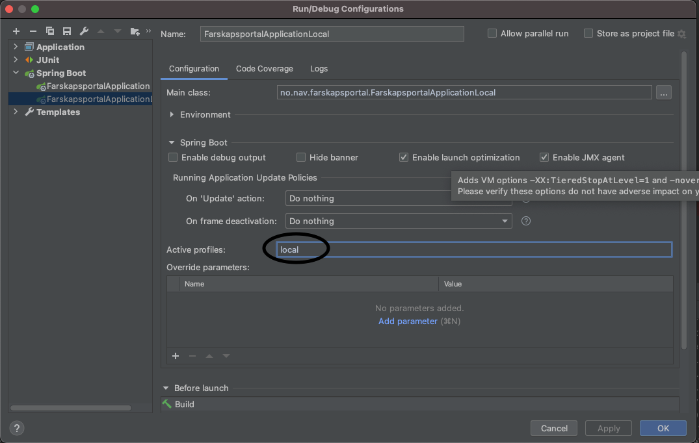

# farskapsportal-backend

Støttefunksjoner for farskapsportal. Gjør oppslag mot PDL for å hente nødvendige personopplysninger i forbindelse med erklæring av farskap. Inneholder
også grenesnitt mot Skatt og Joark for lagring av ferdigstilte farskapserklæringer.

### brukernotifikasjoner

 - #### Oppgave til far om signering
   - Oppgave til far om signering opprettes med ekstern varsling umiddelbart etter at mor har signert

 - #### Beskjed til begge foreldrene om ferdigstilt farskapserklæring
   - Beskjed med ekstern varsling om tilgjengelig farskapserklæring sendes begge foreldrene etter at far har gjennomført signering.

 - #### Beskjed ved avbrutt signering
   - Mor avbryter => ingen beskjed
   - Far avbryter => ekstern beskjed til mor og far

 - #### Beskjed til mor ved utgått signeringsoppgave
   - Mor mottar ekstern melding dersom far ikke signerer innen fristen

 - #### Slette signeringsoppgave
   - Slettemelding sendes umiddelbart etter at far har signert 
   - Slettemelding sendes av skedulert jobb for oppgaver som er eldre enn 30 dager

### hemmeligheter

!NB: Ved k8 delete app må appens Google service account legges til som Secret Manager Accessor for GCP-hemmeligheter (gjelder f.eks tilgang til 
virksomhetssertifikat og passord, samt Postgres-bruker (e.g. kjør >kubectl -n farskapsportal delete secret google-sql-farskapsportal-api-feature ))

### testing av endepunkter

Endepunktene er dokumentert med Swagger, og kan testes lokalt og på GCP dev:

- LOKALT: http://localhost:8080/swagger-ui.html
- DEV: https://farskapsportal-api-feature.dev.nav.no/swagger-ui.html

### testpersoner
Hent testpersoner fra Skatts Tenor testdata: https://www.skatteetaten.no/skjema/testdata/

### lokal kjøring

Ved lokal kjøring brukes Spring-boot-instansen FarskapsportalApplicationLocal. Denne er satt opp med token-supports test-token, og kjøres som standard
med Spring-profilen local (se application.yml). Local-profilen benytter Wiremock for eksterne avhengigheter (security-token-service, pdl-api, Skatt,
og Joark). Data til Wiremock-stubbene leses inn fra test/resources/stubs-mappa.

Kjør følgende GET for å lage cookie med test-token til lokal kjøring (fra token-support): http://localhost:8080/local/cookie?issuerId=tokenx&audience=aud-localhost.
CURLs kan etter dette kjøres direkte fra Swagger uten eksplisitt å legge inn Bearer-token.

Swagger URL: http://localhost:8080/swagger-ui/index.html?configUrl=/v3/api-docs/swagger-config

For kjøring med profilen "local" må et lokalt Docker-miljø være tilgjengelig. Start f.eks Docker Colima på MacOS med

> colima start

før testappen FarskapsportalApplicationLocal startes.

Kjøre fmt-maven-plugin:
> mvn fmt:format

##### Brukernotifikasjon

Brukernotifikasjoner kan skrus av ved å sette miljøvariabelen BRUKERNOTIFIKASJON_PAA til false.

Brukernotifikasjoner bestilles ved å sende meldinger til bestemte Kafka-køer i dev-fss. For å teste brukernotifikasjoner lokalt kreves en lokal 
Kafka-installasjon med et schema registry endepunkt. Dette kan løses ved å sette opp et lokalt Confluent-miljø for Kafka, eller ved å installere 
Apache Kafka direkte som forklart under. 

###### Apache Kafka med Confluent
Gir lokalt Kafka-miljø med schema registry-endepunkt.

Confluent krever Java 11:
> brew install java11
[Download Confluent Community Platform](https://www.confluent.io/get-started/?_ga=2.148999541.2109970909.1623416498-1289707982.1622814896&_gac=1.15004740.1623422632.Cj0KCQjwk4yGBhDQARIsACGfAeuAR4RBBG4Kla1Ix-I5DlHZSKFA3NvuJxoCUWyYimTVHsl2R_Ds7hgaAkomEALw_wcB#confluent-platform)
[Installere Confluent CLI](https://docs.confluent.io/confluent-cli/current/install.html)
[Quick Start using Community Components (Local)](https://docs.confluent.io/5.1.3/quickstart/cos-quickstart.html)

####### Starte lokalt Confluent-miljø
export JAVA_HOME=/usr/local/Cellar/openjdk@11/11.0.10
confluent local services start

###### Kafka Apache
farskapsportal-api sender meldinger til brukernotifkasjons kafka-topics. Ved lokal kjøring brukes lokal Kafkainstans. (Kafka kan installeres på Mac 
med >brew install kafka). Her må aktuelle topics også defineres:

Gå til kafka-installasjonsområdet (på iOS vha brew blir Kafka installert her: /usr/local/Cellar/kafka/2.8.0/libexec), kjør følgende kommandoer for å opprette topics 
(ref [apache kafka quick-start](https://kafka.apache.org/quickstart) for info om oppstart av Kafka):

>./bin/kafka-topics.sh --create --topic aapen-brukernotifikasjon-nyBeskjed-v1 --bootstrap-server localhost:9092 \
>./bin/kafka-topics.sh --create --topic aapen-brukernotifikasjon-nyDone-v1 --bootstrap-server localhost:9092 \
>./bin/kafka-topics.sh --create --topic aapen-brukernotifikasjon-nyOppgave-v1 --bootstrap-server localhost:9092

##### Lese secret fra GCP ved lokal kjøring

For å sette GOOGLE_APPLICATION_CREDENTIALS for lokal kjøring, kjør følgende kommando i terminal med GCP SDK:

>gcloud auth login --update-adc

##### Lokal kjøring uten å lese secret fra GCP
Ved lokal kjøring må Secret Manager være skrudd av. Dette gjøres i bootstrap.yml ved at spring.cloud.gcp.secretmanager.enabled settes til false, og
gjelder alle profiler som ikke kjører på GCP (inkludert enhetstesting). For at dette skal fungere i Intellij, må active profiles settes i
Run/Debug-konfigen som vist i bildet under:

##### Lokal kjøring mot Postgresdatabase på GCP
Profilen remote-postgres kan brukes til å spinne opp en lokal instans av farskapsportal-api som benytter sentral postgres-instans på GCP. Denne krever 
åpen Cloud SQL Proxy mot aktuell databaseinstans samt at miljøvariablene REMOTE_POSTGRES_USER og REMOTE_POSTGRES_PWD er satt med verdier til databasebruker 
med nødvendige rettigheter.

##### Simulere signering lokalt

Gjør et postkall mot signeringsendepunktet i EsigneringStubController for å simulere signering for en part:
 >curl -X POST http://localhost:8080/esignering/api/12345678910/direct/signature-jobs/1/redirect

Etter signering kan endepunktet for mottak av status_query_token etter redirect kalles med en hvilken som helst streng som token.

### Wiremock

Wiremock under enhetstesting for restcontroller og konsument-klassene. Ved enhetstesting (Spring-profil test), legges testdata inn via
WireMock.stubFor (e.g. PdlApiStub).

Wiremock brukes også ved kjøring av local-profilen, da som selvstendig server. Testdata leses da inn fra test/resources/stubs.

### Lombok

Lombok-annoteringer brukes i utstrakt grad for å redusere behovet for kokeplate-kode. For å få Lombok @Value-annotering til å fungere sammen med
Jackson serialisering og deserialisering er det lagt til en egen konfig-fil, lombok.config, under prosjektets rot. Uten denne vil Jackson ikke finne
standard konstruktør, og gi feil "(no Creators, like default construct, exist)" ved kjøring. 
 
### Deploy
NAIS_API_KEY hentes fra https://deploy.nais.io/apikeys

### Rutiner

Fornye virksomhetssertifikat for Posten og Skatt
 - Meld fra til Slack-kanal: #SOC, e-post til soc@nav.no, eller opprett sak via Porten: https://jira.adeo.no/plugins/servlet/desk/portal/601/create/3702
